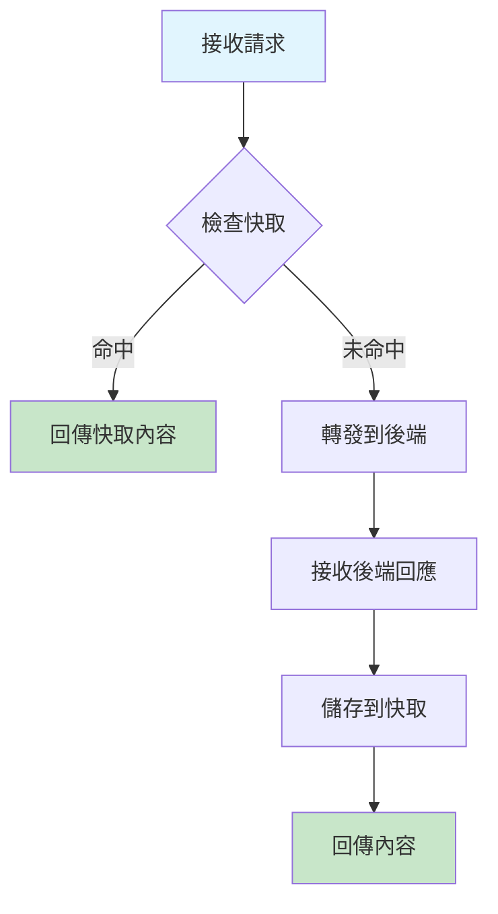

# Custom-Cache-Server-for-WCD

我發現關於 Web Cache Deception 的 CTF 題目均圍繞著快取伺服器和原始伺服器的解析方式差異。加上目前除了 PortSwigger 以外，沒有其他相關的 CTF 題目。因此我想嘗試寫一個能夠自定義解析規則的快取伺服器，讓出題者能夠快速的設計 CTF 題目。

## 設計架構

```mermaid
flowchart TD
    A[接收請求] --> B{檢查快取}
    
    B -->|命中| C[回傳快取內容]
    B -->|未命中| D[轉發到後端]
    
    D --> E[接收後端回應]
    E --> F[儲存到快取]
    F --> G[回傳內容]
    
    style A fill:#e1f5fe
    style C fill:#c8e6c9
    style G fill:#c8e6c9
```